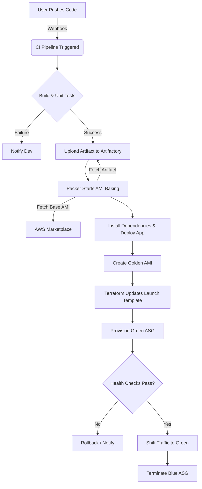

# BakeFoundry Platform Documentation
## Project Overview
Establish a robust **Continuous Integration and Continuous Deployment (CI/CD)** pipeline tailored for legacy applications.

## Key Objectives
- **Modernization**: Transition from manual, error-prone deployment processes to automated, consistent workflows.
- **Reliability**: Ensure reproducible builds and deployments, reducing the risk of human error.
- **Quality Assurance**: Integrate automated testing and code quality checks to maintain high standards.
- **Efficiency**: Accelerate the release cycle, enabling faster time-to-market for critical updates and features.
- **Auditability**: Maintain comprehensive logs and tracking for all changes and deployments to meet compliance requirements.

## Technical Functionalities
- **Pipeline Orchestration**: Event-driven workflow execution (e.g., Push, PR merge) to automate the software delivery lifecycle.
- **Immutable Infrastructure (AMI Baking)**: Automated creation of Golden AMIs (Amazon Machine Images) with pre-configured dependencies and application code.
- **Dynamic Instance Provisioning**: On-the-fly creation of EC2 instances from baked AMIs to ensure fresh, consistent environments for every deployment.
- **Blue-Green Deployment**: Zero-downtime deployment strategy that shifts traffic between two identical environments (Blue and Green) running different application versions.
- **Secrets Management**: Secure, encrypted handling of credentials and API keys using distinct vault solutions or native repository secrets.
- **Infrastructure as Code (IaC)**: Automated provisioning and configuration management of deployment servers using tools like Terraform or Ansible.
- **Artifact Versioning**: Semantic versioning and storage of compilation outputs in a centralized artifact repository.

## Pipeline Workflow
1.  **Commit & Trigger**: Code pushed to GitHub triggers the CI pipeline via webhooks.
2.  **Build & Validation**: The application is compiled, and unit tests are executed. Successful builds produce versioned artifacts which are uploaded to the specific Artifactory repository.
3.  **AMI Baking**: Packer spins up a temporary instance using the latest base AMI from the **AWS Marketplace**, fetches the application artifact from **Artifactory**, installs dependencies, and **deploys the application**. This creates a **Golden AMI** for future deployments.
4.  **Infrastructure Provisioning**: Terraform updates the infrastructure configuration (Launch Templates) to use the new Golden AMI and triggers the creation of new instances.
5.  **Blue-Green Deployment**: A new auto-scaling group (Green) is launched with the new AMI.
6.  **Traffic Switch**: Load balancer traffic is gradually shifted to the Green environment after health checks pass.
7.  **Termination**: The old environment (Blue) is terminated once the deployment is stabilized.

