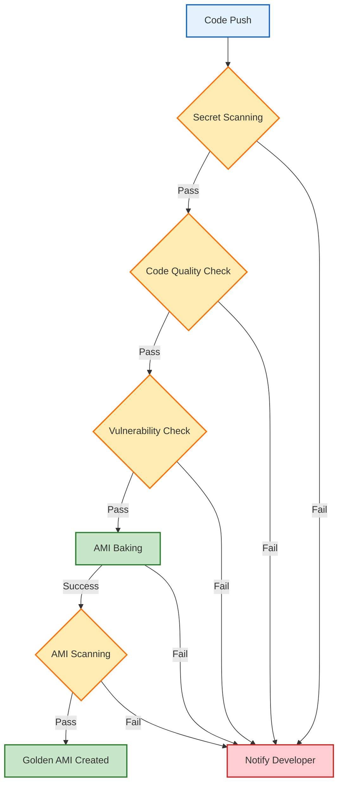

# Introduction

This repository serves as a foundational template for all developers creating applications, ensuring a standardized, secure, and efficient development lifecycle across the organization.

By adopting a unified CI/CD process, we eliminate configuration drift, enforce strict security controls, and guarantee consistent quality gates for every deployment. This standardization not only accelerates delivery by providing pre-configured, battle-tested workflows but also simplifies maintenance and compliance auditing, allowing teams to focus on building features rather than managing infrastructure.

## Key Features

| Feature | Functionality | Tools |
| :--- | :--- | :--- |
| Secret Scanning | Scans code for hardcoded secrets, tokens, and keys to prevent credential leaks. | Gitleaks |
| Code Quality Check | Analyzes source code for stylistic errors, bugs, and programming standard violations. | Pylint, Flake8 |
| Vulnerability Check | Identifies known security vulnerabilities in application dependencies. | Snyk |
| AMI Baking | Automated creation of immutable Amazon Machine Images with pre-configured dependencies. | Packer |
| AMI Scanning | Scans the generated AMI for operating system and package vulnerabilities. | Amazon Inspector |

## Workflow Template Calls

Following core workflows will be called from this template.

Developer will create a new repository by using this template based on technology choice. Templates are available for the below technologies.

| Technology Name | Repository Template Link |
| :--- | :--- |
| Python | https://github.com/BakeFoundry/bk-python-template.git |
| Java | TBD |
| .Net | TBD |

Following are the core workflows that will be called from this template irrespective of the technology choice during continuous intigration.        

| Workflow Name | Description |
| :--- | :--- |
| Secret Scanning | Scans code for hardcoded secrets, tokens, and keys to prevent credential leaks. |
| Code Quality Check | Analyzes source code for stylistic errors, bugs, and programming standard violations. |
| Vulnerability Check | Identifies known security vulnerabilities in application dependencies. |
| AMI Baking | Automated creation of immutable Amazon Machine Images with pre-configured dependencies. |
| AMI Scanning | Scans the generated AMI for operating system and package vulnerabilities. |

## Application Code Workflow

